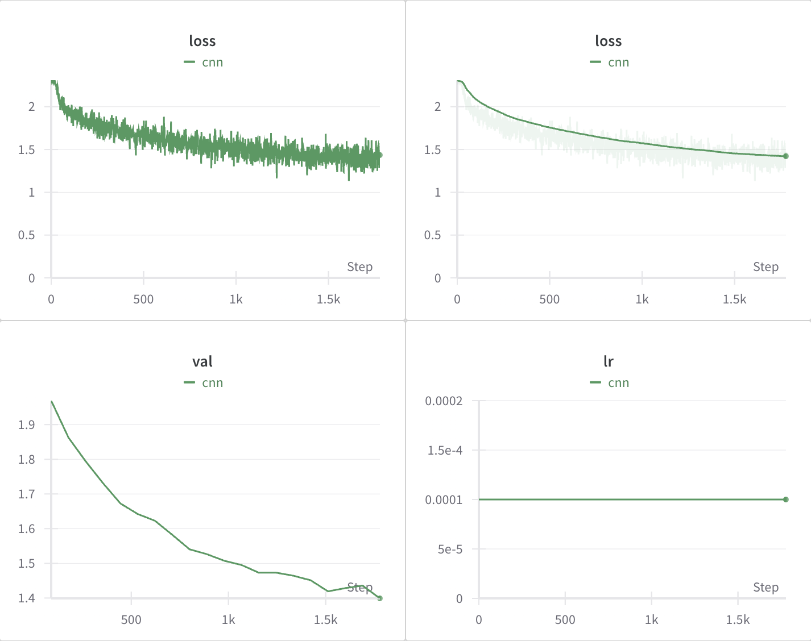
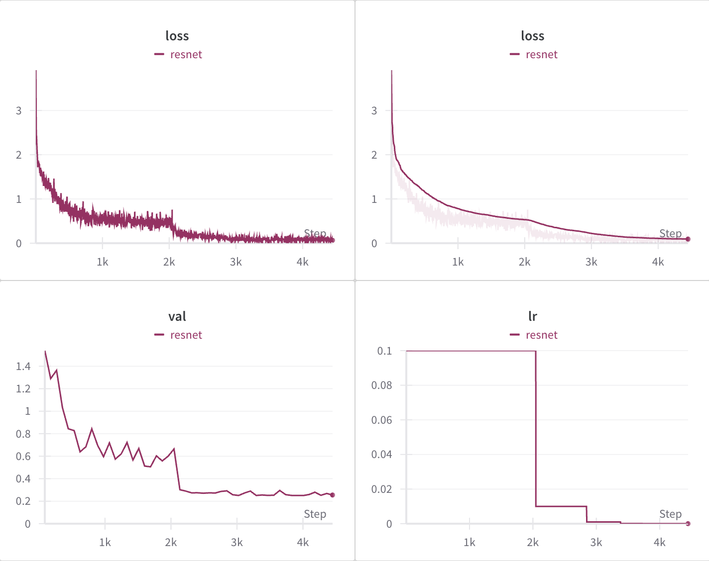
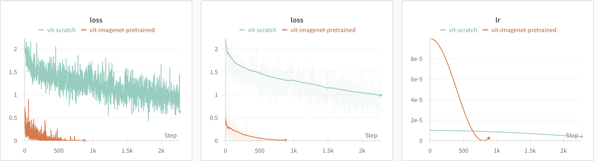

# CIFAR-10
> Classify images from the CIFAR-10 dataset using a variety of modern architectures.

## Project Overview
This project implements a training and testing pipeline for an image classification task on the CIFAR-10 dataset. CIFAR-10 contains 60,000 32x32 RGB images distributed evenly across 10 image classes (6,000 images per class). The provided dataset splits consists of a train set with 50,000 images and a test set with 10,000 images. Here, the train set is further split into a train set with 45,000 images and a validation set with 5,000 images to allow for model evaluation throughout the training process. The models implemented in this repository includes a basic CNN, a resnet, and a vision transformer.

## Setup and Run
The repository contains both a python script and a Jupyter notebook. Each of their setup/run procedures are detailed below.

### Python Script
Clone the repository.
```shell
git clone git@github.com:joe-lin-tech/cifar.git
cd cifar
```

Create and activate a virtual environment. (Alternatively, use an existing environment of your choosing.)
```shell
python3 -m venv venv
source venv/bin/activate
```

Install required pip packages and dependencies.
```shell
python3 -m pip install -r requirements.txt
```

Login to a wandb account if you'd like to view train logs. (If not, make sure to toggle respective flag when running.)
```shell
wandb login
```

Your local environment should now be suitable to run the main script ```train.py```. You can either run it interactively or use the shell to specify run options.

#### Run Interactively
```shell
python3 train.py
```

#### Run in the Shell
```shell
python3 train.py -m previt -d cuda
```
The above command fine tunes a vision transformer pretrained on ImageNet with hyperparameters set to those used in this project.

```shell
python3 train.py -m resnet -e 50 -b 128 -l 0.1 -d cuda
```
The above command trains a resnet-based model on cuda for 50 epochs with batch size of 128 and initial learning rate of 0.1.

| Specifier | Usage |
| --------- | --------- |
| ```-m```, ```--model``` | choose model architecture (```cnn```, ```resnet```, ```previt```, or ```vit```) |
| ```-e```, ```--epoch``` | number of epochs |
| ```-b```, ```--batch-size``` | batch size |
| ```-l```, ```--learning-rate``` | learning rate |
| ```-d```, ```--device``` | device to train/infer on (```cpu```, ```mps```, ```cuda```) |
| ```-c```, ```--cross-validate``` | flag for training with 5-fold cross-validation |
| ```-w```, ```--wandb``` | flag for wandb logging |
| ```-s```, ```--save-folder``` | path to desired model save folder |


### Jupyter Notebook
Download the Jupyter notebook and run the first cell to import relevant packages. The following Python packages are used for this project and may need to be installed directly (if not installed in current environment) with ```!pip install <package name>```.

- **General Purpose:** For shuffling and seeding random processes, use ```random```. To read and write to local file system, use ```os```.
- **Data Manipulation:** Use ```numpy``` to represent and manipulate data.
- **Machine Learning:** Use ```torch``` and ```torchvision```, which are suitable for Computer Vision tasks. For logging the training loop, use ```wandb```.

Run the remaining cells to execute the training procedure of the latest notebook version (pretrained vision transformer).

## Model Architecture and Training
This project involved implementing and training several modern model architectures, each of which are detailed below.

### Basic CNN Architecture
This implementation consists of 3 convolutional layers (conv + relu + max pool) and a fully connected network.

| Layer | Parameters |
| --------- | --------- |
| nn.Conv2d | In Channels: 3 <br> Out Channels: 8 <br> Kernel Size: 5 <br> Stride: 1 <br> Padding: 2 |
| nn.MaxPool2d | Kernel Size: 2 <br> Stride: 2 |
| nn.Conv2d | In Channels: 8 <br> Out Channels: 16 <br> Kernel Size: 5 <br> Stride: 1 <br> Padding: 2 |
| nn.MaxPool2d | Kernel Size: 2 <br> Stride: 2 |
| nn.Conv2d | In Channels: 16 <br> Out Channels: 32 <br> Kernel Size: 5 <br> Stride: 1 <br> Padding: 2 |
| nn.MaxPool2d | Kernel Size: 2 <br> Stride: 2 |
| nn.Linear | In Channels: 512 <br> Out Channels: 64 |
| nn.Linear | In Channels: 64 <br> Out Channels: 32 |
| nn.Linear | In Channels: 32 <br> Out Channels: 10 |

Using the hyperparameters below, the model is capable of achieving ~50% test accuracy on CIFAR-10.

| Hyperparameter | Value |
| --------- | --------- |
| EPOCHS | 20 |
| BATCH_SIZE | 128 |
| LEARNING_RATE | 1e-4 |

| Optimizer | Parameters |
| --------- | --------- |
| Adam | Weight Decay: 0.01 |

Below is the wandb log of training the basic CNN model:



### ResNet Architecture
This implementation utilizes residual connections to improve learning and allow us to build a deeper neural network, all whilst maintaining gradient flow. The original ResNet paper was referred to for implementation and technical details [[1]](#1).

Using the hyperparameters below, the model is capable of achieving ~91% test accuracy on CIFAR-10.

| Hyperparameter | Value |
| --------- | --------- |
| EPOCHS | 50 |
| BATCH_SIZE | 128 |
| LEARNING_RATE | 0.1 |

| Optimizer | Parameters |
| --------- | --------- |
| SGD | Momentum: 0.9 <br> Weight Decay: 5e-4 <br> Nesterov: True |

| Scheduler | Parameters |
| --------- | --------- |
| ReduceLROnPlateau | Mode: max <br> Factor: 0.1 <br> Patience: 3 <br> Threshold: 1e-3 |

Below is the wandb log of training the ResNet model:



### Vision Transformer
The final implementation harnesses the expressive capabilities of transformers, especially with its utilization of self-attention [[2]](#2). Note that instead of patchifying the image and linear projecting, a convolutional layer is applied to obtain patch embeddings. This modification helps "increase optimization stability and also improves peak performance" as described in [[3]](#3).

This project consists of both (1) fine-tuning a vision transformer pretrained on ImageNet and (2) training a vision transformer from scratch.

Using the hyperparameters below, the pretrained vision transformer can be fine tuned to achieve ~97.6% test accuracy (cross-validated) on CIFAR-10.

| Hyperparameter | Value |
| --------- | --------- |
| EPOCHS | 10 |
| BATCH_SIZE | 32 |
| LEARNING_RATE | 1e-4 |

| Optimizer | Parameters |
| --------- | --------- |
| Adam | Momentum: 0.9 <br> Weight Decay: 1e-7 |

| Scheduler | Parameters |
| --------- | --------- |
| CosineAnnealingLR | T_max: 10 |

The same hyperparameters are used to train a vision transformer from scratch except the learning rate is reduced to 1e-5, a different learning rate scheduler was used, and longer training time (details to be added soon).

Below is the wandb log of losses and learning rate for both of these training sessions (fine tune and from scratch):



## References
<a id="1">[1]</a> 
K. He and X. Zhang and S. Ren and J. Sun. Deep Residual Learning for Image Recognition. 2015.

<a id="2">[2]</a> 
A. Dosovitskiy and L. Beyer and A. Kolesnikov and D. Weissenborn and X. Zhai and T. Unterthiner and M. Dehghani and M. Minderer and G. Heigold and S. Gelly and J. Uszkoreit and N. Houlsby. An Image is Worth 16x16 Words: Transformers for Image Recognition at Scale. 2021.

<a id="3">[3]</a>
T. Xiao and M. Singh and E. Mintun and T. Darrell and P. Dollár and R. Girshick. Early Convolutions Help Transformers See Better. 2021.